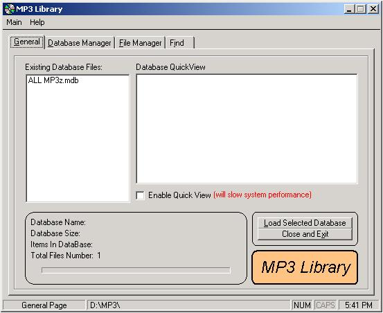



## MP3 Library

### Description

Stores audio files in an Access DB after stripping all of the info if found i.e. mp3 file format)
 
### More Info
 

             |
---                |---
**Submitted On**   |2002-06-16 15:54:54
**By**             |[CycLonE](https://github.com/Planet-Source-Code/PSCIndex/blob/master/ByAuthor/cyclone.md)
**Level**          |Beginner
**User Rating**    |4.7 (14 globes from 3 users)
**Compatibility**  |VB 5\.0, VB 6\.0
**Category**       |[Complete Applications](https://github.com/Planet-Source-Code/PSCIndex/blob/master/ByCategory/complete-applications__1-27.md)
**World**          |[Visual Basic](https://github.com/Planet-Source-Code/PSCIndex/blob/master/ByWorld/visual-basic.md)
**Archive File**   |[MP3\_Librar1493311172002\.zip](https://github.com/Planet-Source-Code/cyclone-mp3-library__1-40491/archive/master.zip)

